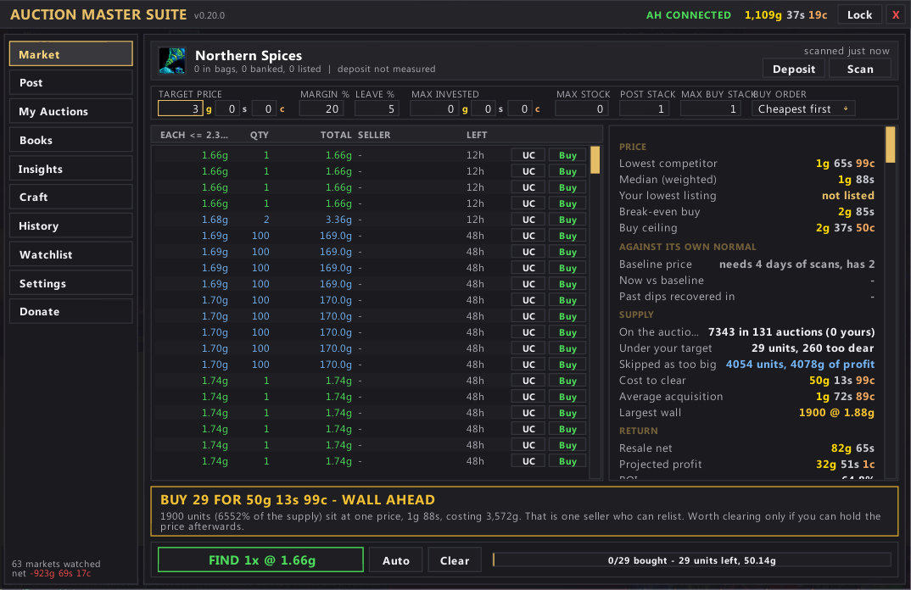
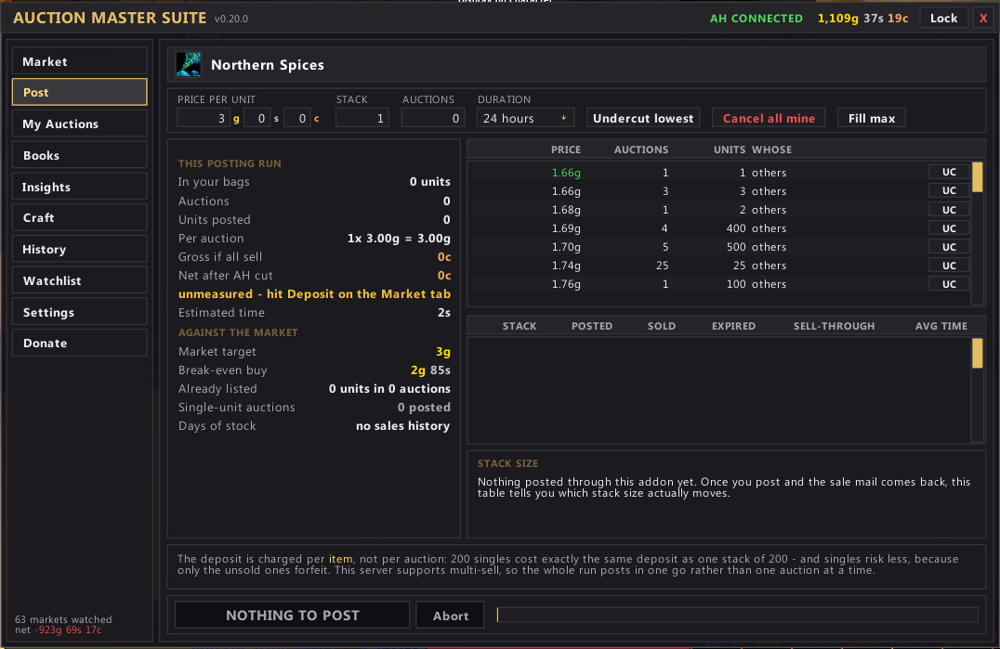
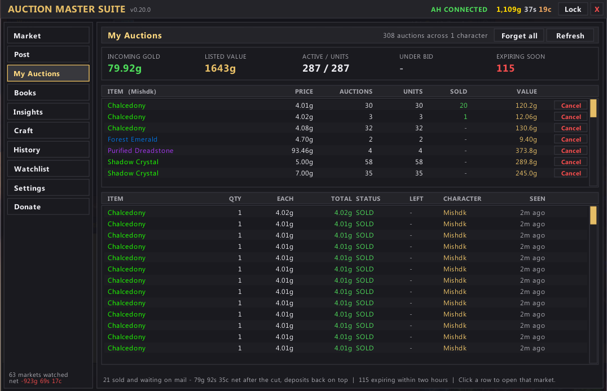
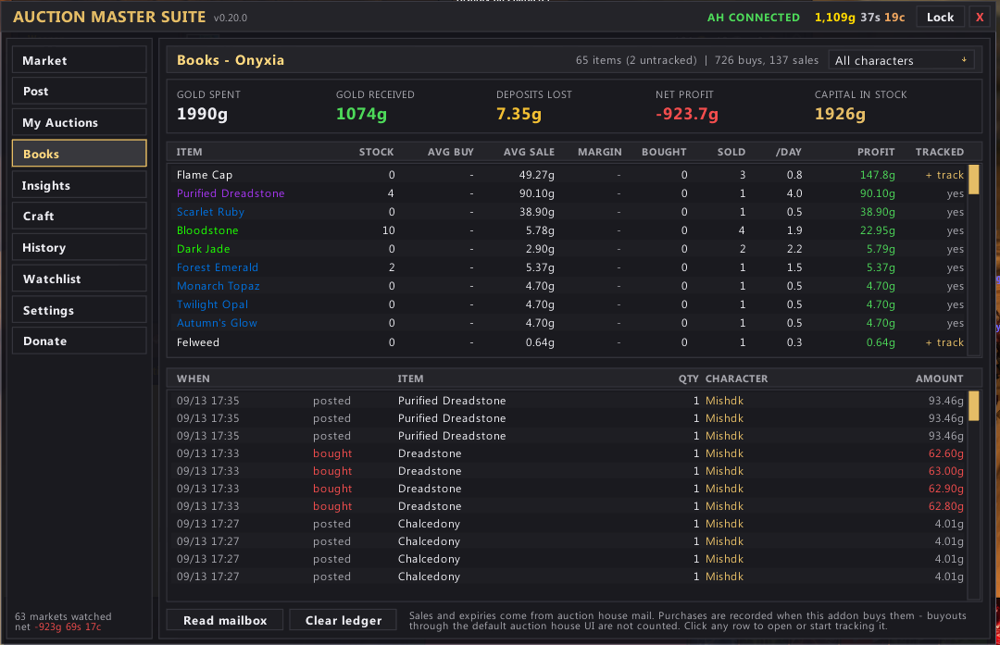
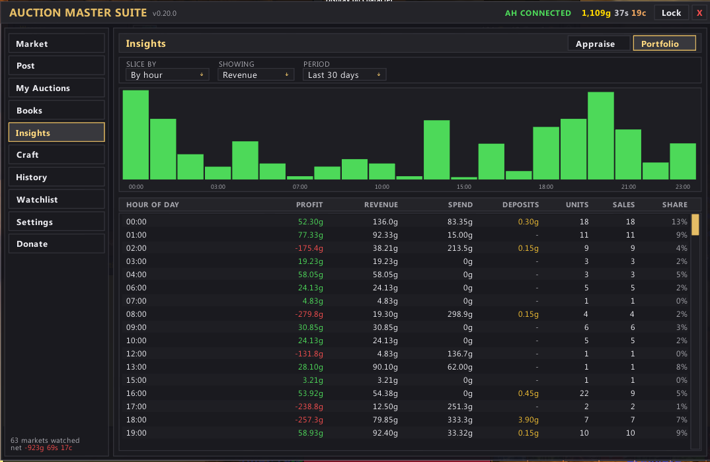
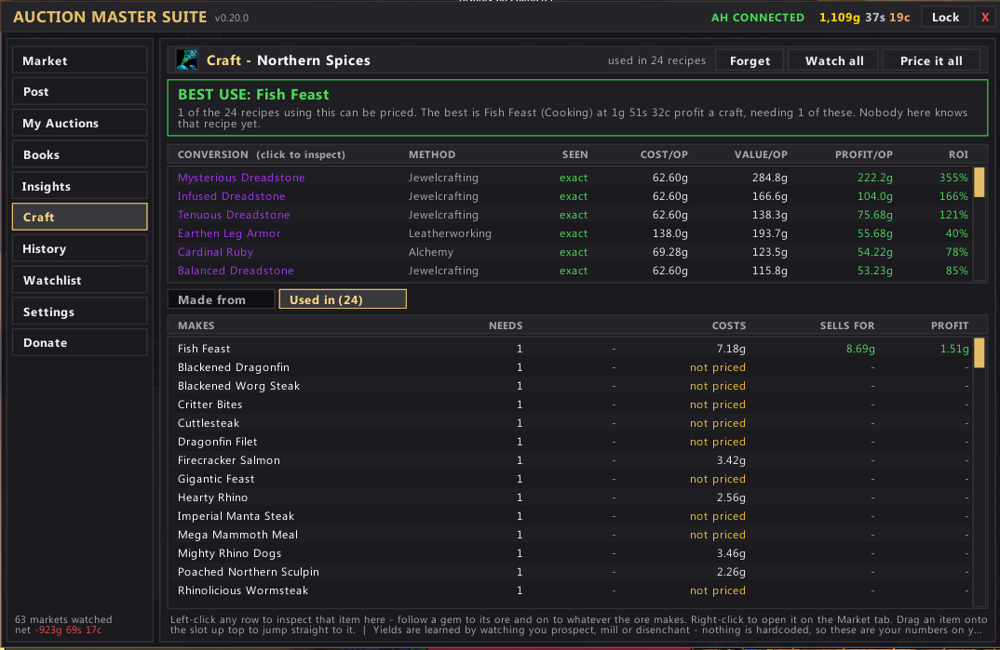
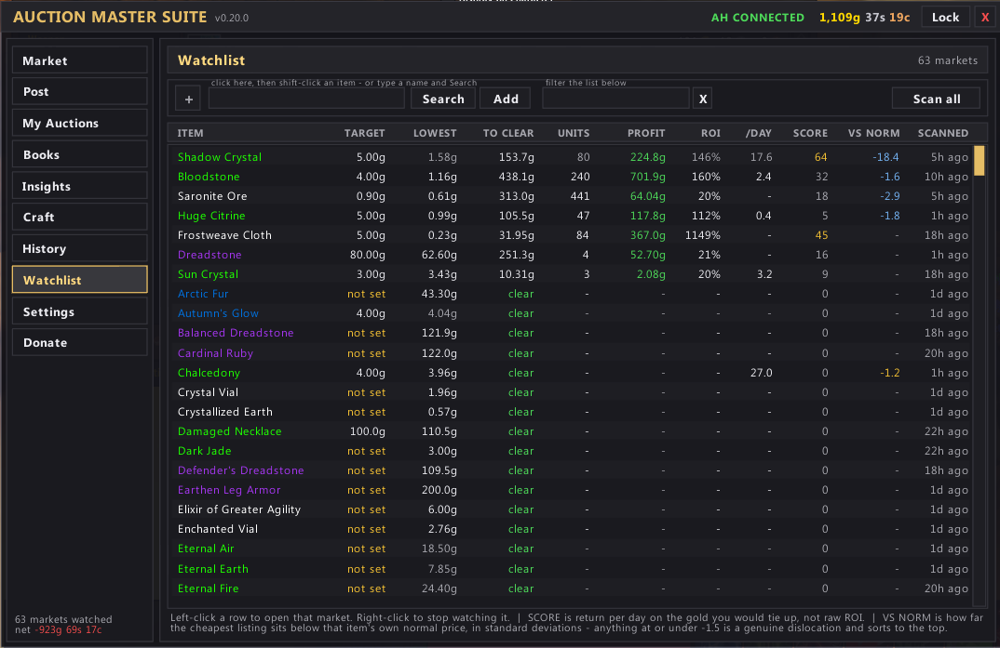
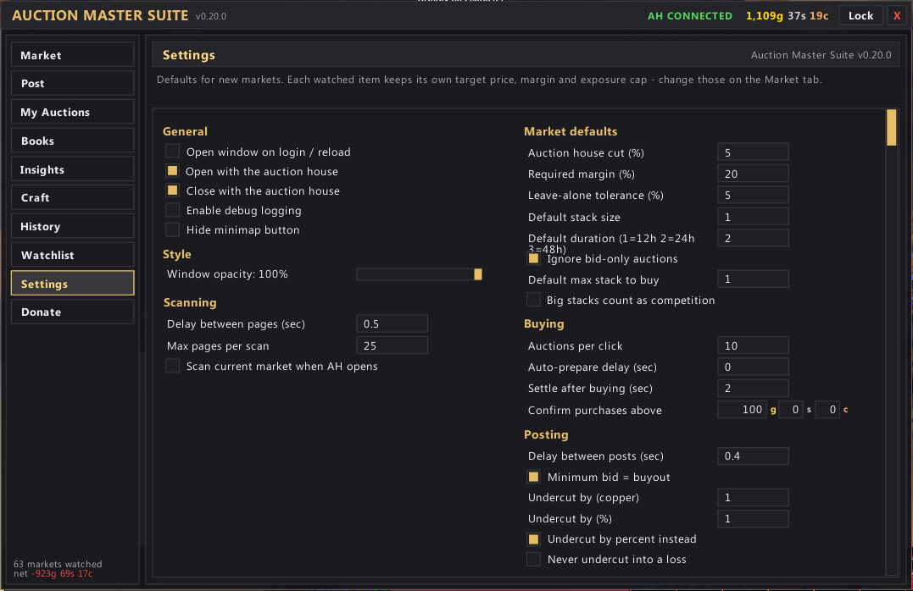
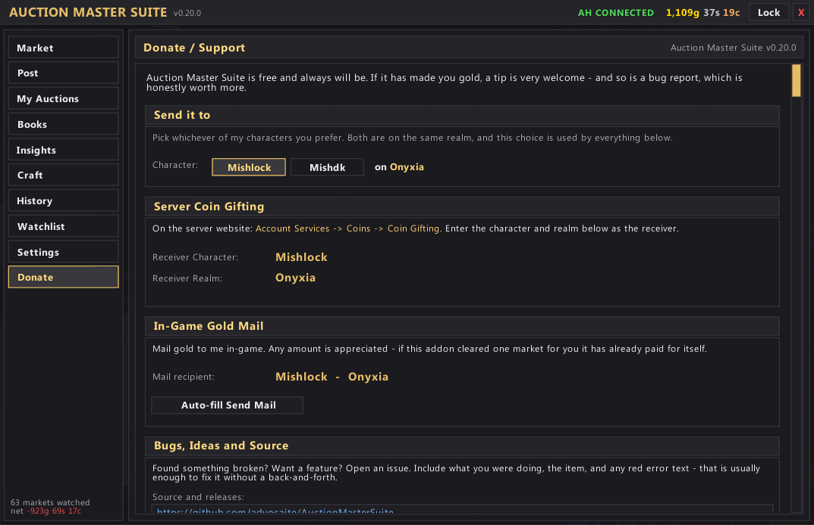

# Auction Master Suite

An auction house addon for **World of Warcraft 3.3.5a (WotLK)** built around one idea: pick a
commodity, own it, and know your numbers while you do it.

It tells you what it costs to clear every listing under your price, buys them in batches, reposts
your stock, and keeps an honest ledger of what you actually made — per item, per character, over
time. Dark/gold themed, self-contained, no dependencies.

> **Status:** v0.28.0 — actively developed. Bug reports and feature requests very welcome.
>
> **Repo:** https://github.com/advocaite/AuctionMasterSuite — open an
> [Issue](https://github.com/advocaite/AuctionMasterSuite/issues) for anything broken or missing.

---

## Why you'd use it

The auction house UI can tell you the lowest price. It cannot tell you:

- what it costs to buy **every** listing under your target, in one number
- whether that purchase leaves a margin after the 5% cut
- whether the item sells nine times a day or twice a week
- whether you are up or down on it since you started
- what it would cost to **craft** it instead of buying it

That is the entire addon.

---

## Install

1. Download this repo and drop the folder into your AddOns directory so it looks like:
   ```
   World of Warcraft 3.3.5a/Interface/AddOns/AuctionMasterSuite/
   ```
   The folder **must** be named `AuctionMasterSuite`. If you downloaded a zip from GitHub it will
   unpack as `AuctionMasterSuite-main` — rename it.
2. Start WoW and make sure it is ticked in the AddOns list on the character screen.
3. Type `/ams` in chat, or click the gold coin on your minimap.

No Ace, no LibStub, nothing else to install.

---

## Screenshots

### Market


### Post


### My Auctions


### Books


### Insights


### Craft


### Watchlist


### Settings


### Donate


---

## Quick start

1. Go to an auctioneer and open the addon.
2. On the **Market** tab, drag an item into the slot at the top, or shift-click an item link into
   it, or type `/ams Saronite Ore`.
3. Set your **target price** — what you intend to sell each one for.
4. Hit **Scan**. You now have a cost to clear, a buy ceiling and a verdict.
5. If it says GO, click **Buy** repeatedly until the queue is empty.
6. Move to **Post**, check the price ladder, and post your stock.
7. Come back tomorrow and look at **Books**.

---

## The three numbers it is built around

**Buy ceiling.** Not "anything below my target". If you sell at 5g, the AH takes 5%, so you receive
4.75g. Buying at 4.9g loses money on every single unit. The ceiling is the highest price that still
leaves the margin you asked for, after the cut.

**Cost to clear.** The total gold needed to buy every listing beneath your target, and how many
units that is. This is the number that decides whether you can actually take a market or only
annoy it — clearing half the listings just hands the rest of the sellers your price.

**Return per day.** Profit per unit multiplied by how fast the item actually moves, divided by the
gold you have tied up. The Watchlist ranks on this and deliberately **not** on ROI, because 100%
margin on something that sells twice a week is a worse business than 20% on something that sells
ninety times a day.

---

## The tabs

| Tab | What it does |
|---|---|
| **Market** | The main screen. Pick an item, set a target, scan. Cost to clear, buy ceiling, supply, your holdings, and a verdict. Buy in batches from here. |
| **Post** | Post your stock. Price ladder of everyone currently listed, with per-row undercut and cancel, plus undercut-lowest and cancel-all buttons. |
| **My Auctions** | Everything you have listed right now, what is about to expire, and the gold sitting in your mailbox from sales. |
| **Books** | The ledger. What you bought, what you sold, what you actually made — per item and per character, including items you never watched. |
| **Insights** | Charts. Price history, sell-through rate, where your gold came from, and alerts when something is trading well below its normal price. |
| **Craft** | Three views of the same data: what an item is **made from**, what it is **used in** (the direction that finds you markets), and a whole **profession** at a time — everything it can make and what each needs, yours or not. Costs every route with live prices and picks the cheapest. |
| **History** | Every scan snapshot kept per item, so you can see a market move rather than guess. |
| **Watchlist** | All your markets, ranked by return per day. Search as you type. |
| **Settings** | Defaults for scanning, buying, posting and alerts. Each watched item can override them. |
| **Donate** | How to support the addon, and where to report bugs. |

A draggable coin on the minimap toggles the window on left-click and opens Settings on
right-click. It can be hidden in Settings.

---

## Slash commands

| Command | What it does |
|---|---|
| `/ams` or `/auctionmaster` | Toggle the window |
| `/ams <item name>` | Open that item's market |
| `/ams add <item name>` | Add an item to the watchlist |
| `/ams scan` | Rescan the current market |
| `/ams books` | Jump to the ledger |
| `/ams craft` | Jump to the crafting tab |
| `/ams settings` | Jump to Settings |
| `/ams donate` | Support / bug reports |
| `/ams donate chat` | Print the donation details into chat |
| `/ams debug` | Verbose logging, for when you are filing a bug |
| `/ams attribute <character>` | Stamp old ledger entries with a character name |

---

## Crafting data

The Craft tab does not need another addon installed and does not phone anything. The recipe
database was extracted from your own game client's `Spell.dbc` and ships as a data file:

- **3,443** craftable items
- **3,667** recipes (several spells often make the same item — it costs each one and picks the
  cheapest at today's prices)
- **267** enchants, costed from their reagents and matched to the `Scroll of ...` you would sell.
  The vellum is not counted: there are six of them and which one an enchant needs is not in the
  spell data, so the tab says a vellum is extra rather than guessing at one

On top of that it learns things the client does not record: prospecting, milling and disenchanting
yields are worked out by watching your bags before and after, so the more you do the better its
numbers get.

The recipe data is all item IDs, and your client only knows the name of an item it has actually
seen — which is why a reagent you have never owned starts out as `item #37663`. The addon asks the
server for the ones on screen and fills the names in as they arrive, a few at a time so nothing
gets throttled.

Every table that lists items shows its icon, and hovering one gives you the real item tooltip —
which is also the request, so it resolves that item immediately rather than waiting its turn.

## Prices are shared

Every scan records a price for **everything it saw**, not just the item you asked for. A scan reads
whole pages, and a page is full of other people's items at real, current prices — so a reagent no
longer sits at "not priced" because you only ever met it sideways. One search picks up a few hundred
items in passing.

Those prices are saved per realm and read by every tab, so what the Craft tab costs a recipe at is
the same number the Market tab is looking at. Items you actually watch keep their full scan history;
ones seen in passing keep a shorter one, so the saved-variables file stays a sensible size.

---

## Honest limitations

**Buying and cancelling need a click.** Blizzard requires a real keypress or mouse click for
`PlaceAuctionBid` and `CancelAuction`. No addon can buy a queue out unattended — this one included.
What it does instead is make each click count: one click buys a whole batch off the loaded page,
so clearing a market is a few clicks instead of a few hundred.

**Prices are only as fresh as your last scan.** Open an item you scanned earlier and the numbers
come back marked `stored from 2h ago`. That is shape, not a price you can trade on — rescan before
you buy. The Buy button will not act on stored data.

**It is not a full AH replacement.** There is no browse-everything interface. It is built for
running a handful of commodities properly, not for window shopping.

**Deposit is charged per item, not per auction.** So one hundred singles and one stack of one
hundred cost you exactly the same deposit. The addon assumes you know that; the Post tab shows the
drag either way.

---

## Your data

| SavedVariable | Holds |
|---|---|
| `AuctionMasterSuiteDB` | Account-wide: settings, watched markets, scan history, ledger. Internally split per realm, so two realms never mix. |
| `AuctionMasterSuiteCharDB` | Per-character odds and ends |

Nothing is uploaded anywhere. To start clean, log out, delete
`WTF/Account/<account>/SavedVariables/AuctionMasterSuite.lua`, log back in.

---

## Reporting a bug

Open an [issue](https://github.com/advocaite/AuctionMasterSuite/issues) with:

1. What you were doing and which tab you were on
2. The item, if it was item-specific
3. Any red error text — turn on `/ams debug` first if you can reproduce it

That is usually enough to fix it without a back-and-forth.

---

## Credits

- Built for and tested on Warmane, 3.3.5a.
- Recipe and enchant data extracted from the client's own DBC files — no runtime dependency on any
  other addon.
- Visual style shared with [Raid Master Suite](https://github.com/advocaite/RaidMasterSuite).

---

## License

MIT. Use it, fork it, modify it, ship it. Attribution appreciated, not required.

---

## Support the project

Free forever, and nothing is locked behind a donation. If it has made you gold and you want to
throw some back, the in-game **Donate** tab has the details, or:

- **Coin gifting:** receiver `Mishlock` or `Mishdk` on `Onyxia`
- **Gold by in-game mail:** `Mishlock` or `Mishdk` on `Onyxia`

Bug reports and feature ideas are worth just as much. <3
